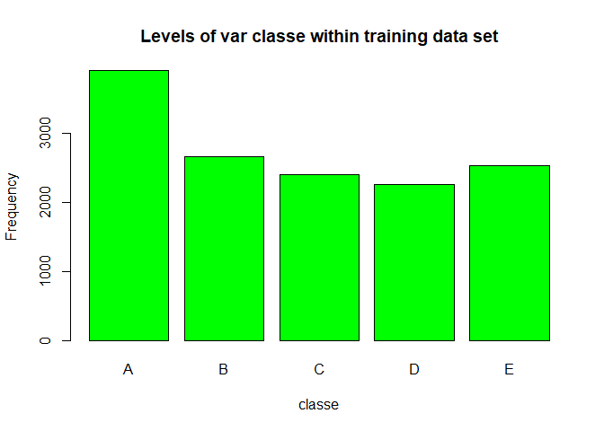
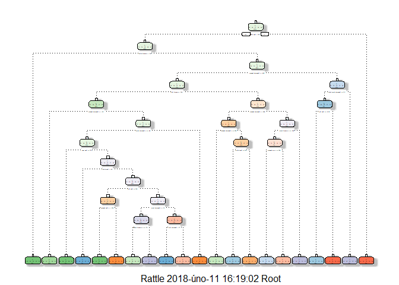

## Background

Using devices such as Jawbone Up, Nike FuelBand, and Fitbit it is now possible to collect a large amount of data about personal activity relatively inexpensively. These type of devices are part of the quantified self movement – a group of enthusiasts who take measurements about themselves regularly to improve their health, to find patterns in their behavior, or because they are tech geeks. One thing that people regularly do is quantify how much of a particular activity they do, but they rarely quantify how well they do it. In this project, the goal is to use data from accelerometers on the belt, forearm, arm, and dumbell of 6 participants. They were asked to perform barbell lifts correctly and incorrectly in 5 different ways. More information is available from the website here: <http://web.archive.org/web/20161224072740/http:/groupware.les.inf.puc-rio.br/har> (see the section on the Weight Lifting Exercise Dataset).

## Goal of the project
I will use two models in this project with the sensor data. I will use it to train and test the models.
Models are:

1) Random Forests
2) Recursive Partitioning and Regression Trees

## Reproducibility

I set the pseudo-random number generator set.seed at 1221 for the whole project.
I use the "caret" package available for R and leave all the parameter at default value in this project.
Different packages are downloaded and installed, such as caret, rattle, rpart and randomForest. These packages must be installed in order to reproduce the results in this analysis. See the code below for ways and syntax to reproduce the results.


```
## Warning: package 'caret' was built under R version 3.4.3
```

```
## Loading required package: lattice
```

```
## Loading required package: ggplot2
```

```
## Warning: package 'rattle' was built under R version 3.4.3
```

```
## Rattle: A free graphical interface for data science with R.
## Version 5.1.0 Copyright (c) 2006-2017 Togaware Pty Ltd.
## Type 'rattle()' to shake, rattle, and roll your data.
```

```
## Warning: package 'rpart' was built under R version 3.4.3
```

```
## Warning: package 'randomForest' was built under R version 3.4.3
```

```
## randomForest 4.6-12
```

```
## Type rfNews() to see new features/changes/bug fixes.
```

```
## 
## Attaching package: 'randomForest'
```

```
## The following object is masked from 'package:rattle':
## 
##     importance
```

```
## The following object is masked from 'package:ggplot2':
## 
##     margin
```

## Data set
The inital data cleansing must be done during loading data:
1) Remove all columns that contain mostly NAs
2) Remove columns with non-numeric variables

I load the training and testing datasets from url, read them into the memory and check the dimensions:


```r
set.seed(1221)

trainUrl <- "http://d396qusza40orc.cloudfront.net/predmachlearn/pml-training.csv"
testUrl <- "http://d396qusza40orc.cloudfront.net/predmachlearn/pml-testing.csv"

training <- read.csv(url(trainUrl), na.strings=c("NA","#DIV/0!",""))
testing <- read.csv(url(testUrl), na.strings=c("NA","#DIV/0!",""))

dim(training)
```

```
## [1] 19622   160
```

```r
dim(testing)
```

```
## [1]  20 160
```

## Cleaning the data

I made following transformations to clean the trainig data set:

I remove NearZeroVariance Variables, useless columns and delete columns with all missing values 

```r
NZV <- nearZeroVar(training, saveMetrics = TRUE)
training <- training[, !NZV$nzv]

NZV <- nearZeroVar(testing, saveMetrics = TRUE)
testing <- testing[, !NZV$nzv]

Cols <- grep("name|timestamp|window|X", colnames(training), value=F) 
training <- training[,-Cols]

trainingSet <-training[,colSums(is.na(training)) == 0]
testingSet <-testing[,colSums(is.na(testing)) == 0]

# training$classe <- as.factor(training$classe)
# testing$classe <- as.factor(testing$classe)

dim(trainingSet)
```

```
## [1] 19622    53
```

```r
dim(testingSet)
```

```
## [1] 20 59
```

## Cross-validation

To perform the cross-validation I subsample the trainingSet data set randomly without replacement into 2 datasets. I use 70% of the original trainingSet data set like trainig data set and 30% like testing data set. I fit the models on the training data set and test it on the testing data set. Once the most accurate model is choosen, I test it on the original testingSet data set. The outcome variable “classe” is the factor variable. 


```r
partition <- createDataPartition(y=trainingSet$classe, p=0.7, list=FALSE)
training <- trainingSet[partition, ] 
testing <- trainingSet[-partition, ]
```

I check the variable "classe" which contains 5 levels: A, B, C, D, E. I make a plot of that variable to see the frequency of each levels in my training data set and compare one another.


```r
plot(training$classe, col="green", main="Levels of var classe within training data set", xlab="classe", ylab="Frequency")
```

<!-- -->

Each level is within the same order of magnitude of each other. Level A is the most frequent and level D is the least frequent.

## Expected out-of-sample error

The expected out-of-sample error corresponds to the quantity = 1-accuracy in the cross-validation data. Accuracy is the proportion of the number of correctly classified observations over the number of the total sample in the training data set. 
Expected accuracy is the expected accuracy in the out-of-sample data set (i.e. original testing data set). Thus, the expected value of the out-of-sample error will correspond to the expected number of missclassified observations/total observations in the Test data set, which is the quantity: 1-accuracy found from the cross-validation data set.


## Data modeling

To predict the manner in which the user did the exercise I use models:
1) Decision Tree and 
2) Random Forest.

### 1) Decision Tree


```r
modFitDT <- rpart(classe ~ ., method="class", data=training)
fancyRpartPlot(modFitDT)
```

<!-- -->

```r
predDT <- predict(modFitDT, testing, type = "class")
confusionMatrix(predDT, testing$classe)
```

```
## Confusion Matrix and Statistics
## 
##           Reference
## Prediction    A    B    C    D    E
##          A 1537  249   73  182   79
##          B   49  681   88   48   71
##          C   35   72  783  137  102
##          D   24   84   57  505   49
##          E   29   53   25   92  781
## 
## Overall Statistics
##                                           
##                Accuracy : 0.7285          
##                  95% CI : (0.7169, 0.7398)
##     No Information Rate : 0.2845          
##     P-Value [Acc > NIR] : < 2.2e-16       
##                                           
##                   Kappa : 0.653           
##  Mcnemar's Test P-Value : < 2.2e-16       
## 
## Statistics by Class:
## 
##                      Class: A Class: B Class: C Class: D Class: E
## Sensitivity            0.9182   0.5979   0.7632  0.52386   0.7218
## Specificity            0.8616   0.9461   0.9288  0.95651   0.9586
## Pos Pred Value         0.7250   0.7268   0.6935  0.70236   0.7969
## Neg Pred Value         0.9636   0.9074   0.9489  0.91115   0.9386
## Prevalence             0.2845   0.1935   0.1743  0.16381   0.1839
## Detection Rate         0.2612   0.1157   0.1331  0.08581   0.1327
## Detection Prevalence   0.3602   0.1592   0.1918  0.12218   0.1665
## Balanced Accuracy      0.8899   0.7720   0.8460  0.74019   0.8402
```
### 2) Random Forest


```r
modFitRF <- randomForest(classe ~. , method="class", data=training)
predRF <- predict(modFitRF, testing, type = "class")
confusionMatrix(predRF, testing$classe)
```

```
## Confusion Matrix and Statistics
## 
##           Reference
## Prediction    A    B    C    D    E
##          A 1674    5    0    0    0
##          B    0 1128    9    0    0
##          C    0    6 1016    7    0
##          D    0    0    1  957    4
##          E    0    0    0    0 1078
## 
## Overall Statistics
##                                           
##                Accuracy : 0.9946          
##                  95% CI : (0.9923, 0.9963)
##     No Information Rate : 0.2845          
##     P-Value [Acc > NIR] : < 2.2e-16       
##                                           
##                   Kappa : 0.9931          
##  Mcnemar's Test P-Value : NA              
## 
## Statistics by Class:
## 
##                      Class: A Class: B Class: C Class: D Class: E
## Sensitivity            1.0000   0.9903   0.9903   0.9927   0.9963
## Specificity            0.9988   0.9981   0.9973   0.9990   1.0000
## Pos Pred Value         0.9970   0.9921   0.9874   0.9948   1.0000
## Neg Pred Value         1.0000   0.9977   0.9979   0.9986   0.9992
## Prevalence             0.2845   0.1935   0.1743   0.1638   0.1839
## Detection Rate         0.2845   0.1917   0.1726   0.1626   0.1832
## Detection Prevalence   0.2853   0.1932   0.1749   0.1635   0.1832
## Balanced Accuracy      0.9994   0.9942   0.9938   0.9959   0.9982
```


## Results - which prediction model is recommended to use:

The Random Forest algorithm has better results than the Decision Trees. The accuracy for Random Forest model is 0.9946 (95% CI: (0.992, 0.996)). On the other side the Decision Tree model has accuracy 0.7285 (95% CI: (0.717, 0.740)). I decide to choose the Random Forests model for prediction of the manner in which the users did the exercise. The expected out-of-sample error is estimated at 0.005, or 0.5%.


## Final step

As the last step I make the prediction applied on the testingSet data set, that was downloaded at the begining of the project. I use the model modFitRF created with Random Forest algorithm.


```r
predictfinal <- predict(modFitRF, testingSet, type="class")
predictfinal
```

```
##  1  2  3  4  5  6  7  8  9 10 11 12 13 14 15 16 17 18 19 20 
##  B  A  B  A  A  E  D  B  A  A  B  C  B  A  E  E  A  B  B  B 
## Levels: A B C D E
```

The end.

